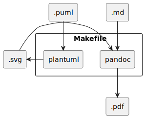

A collection of tools for rendering Markdown files as PDF using the
Data In Logistics document template.

# Prequisites

A basic UNIX-like environment with `sed`, `grep`, `GNU make`.

[pandoc](https://pandoc.org/) and a fairly complete LaTeX
installation; see [Creating a PDF in the Pandoc
manual](https://pandoc.org/MANUAL.html#creating-a-pdf)

`plantuml`, if plantuml source files are used for diagrams.

# Usage

To convert foo.md file to a DIL-styled PDF, type

```sh
cd directory/containing/markdown
make -f path/to/this/repo/Makefile foo.pdf
```



# LaTeX usage

To use these templates from LaTeX directly (instead of using
markdown), set `TEXINPUTS` environment to include the `latex`
directory in this repo, and use

```latex
\usepackage{datainlogistics}
```

# Example output

[Result of processing this README](readme.pdf)
